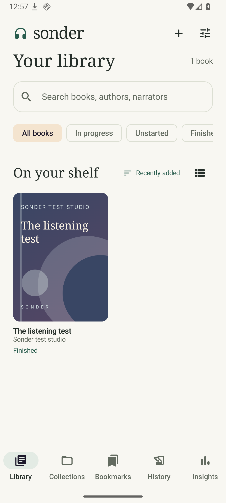
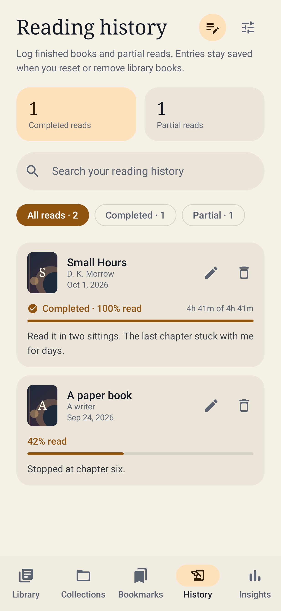
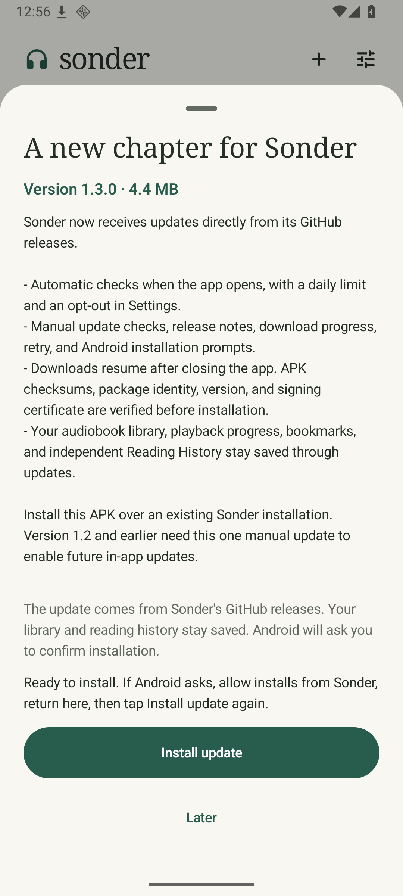

# Sonder for Android

A native audiobook library and player with offline listening, built with Kotlin, Jetpack Compose, Android SQLite, and Media3. Android 9 and later. Application ID `app.sonder.audiobooks`.

[Download the latest Android APK](https://github.com/Robertg761/Sonder/releases/latest) · [Privacy](PRIVACY.md)

Install over your existing Sonder app to keep its library.

<p>



</p>

## Install and listen

Open the supplied `Sonder-1.7.2.apk` on your Android phone. Install it over the existing app without uninstalling it to preserve your library, progress, bookmarks, and granted folder access. Android may ask you to allow installation from the app that opened the file. Open Sonder, tap **+**, and choose files or a folder through the system picker.

Folders are scanned recursively. Matching album and author tags group tracks into books across file and folder selections. Untagged M4B/MP4 files and files with multiple embedded chapters remain separate books. Other untagged tracks in the same folder are grouped using the folder name. Tracks use natural filename order. The original media files stay where you selected them, so keep that folder, SD card, or document provider available. Cloud document providers must make the files available locally for offline playback. If a provider refuses persistent read permission, Sonder warns you; selecting the file again may be required after restarting.

The initial library is empty. Test tones and test books are confined to the test APK and are not bundled with the release app.

## App updates

The public repository is [Robertg761/Sonder](https://github.com/Robertg761/Sonder). Install the latest APK from [Releases](https://github.com/Robertg761/Sonder/releases/latest). Versions 1.2 and earlier need one manual update to enable the updater.

Sonder checks the latest stable GitHub release when it opens, at most once a day. Settings includes an automatic-check toggle and a manual check. An update notice opens release notes and a download button. Downloads use Android DownloadManager and can finish with the app closed. Return to the app to install. Downloads are checked against the GitHub SHA-256 digest and the installed app's package, version, and signing certificate. Nothing is installed silently. Android asks for install permission and confirmation. If you allow installs from Sonder in Android settings, return and tap Install update again. Cancel or retry a failed download from the update sheet. If an abrupt shutdown happens just as a download starts, check again and retry if it does not appear.

The `.github/workflows/android.yml` workflow builds, tests, and lints pull requests. A push to main with a new versionName and versionCode builds and signs a release, then publishes the APK, AAB, and checksums. Existing release versions are skipped. Update `RELEASE_NOTES.md` for each release. A matching version tag or manual workflow dispatch also runs the release workflow. The two signing secrets are `SONDER_KEYSTORE_B64` and `SONDER_KEYSTORE_PASSWORD`; the private key is decoded in a temporary directory and never committed. Keep the same key for every update.

## AudioBookBay downloads

Sonder can search AudioBookBay and download a book into your library through your [Real-Debrid](https://real-debrid.com) account. This is off until you set it up in **Settings → AudioBookBay downloads**:

1. **Real-Debrid**: paste your API token from [real-debrid.com/apitoken](https://real-debrid.com/apitoken). Sonder checks it and shows your account. Torrents need a premium account.
2. **Download folder**: choose a folder, such as `Audiobooks`, through the system picker. Sonder asks for read and write access to it.
3. **AudioBookBay address**: AudioBookBay changes domains. If searches stop working, enter the address that works in your browser.

Then open the **Find** tab (or tap **+ → Find on AudioBookBay**), search for a title or author, open a result, and tap **Download to library**. Before anything is queued, Sonder adds the upload to Real-Debrid and watches it for up to a minute. If Real-Debrid already has it, or finds someone sharing it, the download starts; if nobody is sharing it, Sonder says so, deletes the torrent from your account, and suggests trying another time or another upload. AudioBookBay only finds titles containing every word you type, so Sonder also tries looser searches (without punctuation and words like "the" or "by", across descriptions, and with just the most distinctive words) and lists the closest titles first. A typo in one word usually still finds the book. Sonder reads the page's info hash and trackers to build a magnet link, adds it to Real-Debrid, selects the audio files, and waits until Real-Debrid has the whole upload. Uploads Real-Debrid already has are usually ready immediately; others take as long as Real-Debrid needs to fetch them. Sonder then streams the files into a new folder named after the book and imports that folder like any other. Downloads continue with Sonder in the background and show progress in a notification.

Sonder downloads only audio, CUE chapter sheets, and one cover image (saved as `cover.jpg`). Programs, archives, NFO/text files, scanned pages, and torrent padding are never downloaded. Pages that list programs show a warning, because audiobooks don't need them and fake uploads often include them. Uploads packed in ZIP/RAR archives can't be used. Disc folders such as `CD1/01.mp3` are flattened into one folder as `CD1 - 01.mp3` so the tracks import as one book in order. CUE sheets in such uploads no longer match the renamed files, so they're skipped and the book uses its embedded or per-track chapters.

A failed or interrupted download keeps its partial files. **Retry** resumes from where it stopped and gets fresh Real-Debrid links. **Cancel** (on the download in Find, on the book's page, or in the progress notification) or **Remove** on an unfinished download deletes the folder Sonder created for it, unless adding it to the library had already started; removing it also deletes its torrent from your Real-Debrid account so the transfer stops. Removing a finished download only clears it from the list; the book stays in your library, and Real-Debrid keeps that torrent in your account's list. If Real-Debrid doesn't start an upload within 45 seconds of Sonder choosing its files, Sonder selects every file instead; only audio, CUE sheets, and the cover still download to your phone. A download stops with an explanation if Real-Debrid stays waiting for five minutes after that, sits with no seeders and no progress for 20 minutes, or makes no progress for an hour, so you can retry later. Android 15 limits background data transfers to six hours a day; a download stopped that way can be retried.

Respect the copyright laws where you live. Only download books you have the right to.

## Resuming playback

After pausing, press Play to resume five seconds earlier. This also works through Android media controls, including the lock screen and headset buttons. The position stays where you paused until you resume. The five-second rewind can cross track files and stops at the beginning of the book.

Audible notifications that temporarily take Android audio focus pause narration, including notifications that ask other audio to lower its volume. When focus returns, Sonder resumes five seconds earlier. A manual pause during an interruption keeps playback paused. Another app taking permanent focus requires you to press Play again. Silent notifications and sounds that do not request audio focus do not interrupt playback. This follows [Android's audio-focus handling for speech](https://developer.android.com/media/optimize/audio-focus).

Seeking, skipping, or jumping to a bookmark while paused keeps the position you selected. Opening a different book and normal buffering do not trigger this resume rewind. The existing **Smart rewind** setting controls the separate rewind when reopening a book.

## Reading history

Open the **History** tab to keep your own reading record. Log a completed book or a partial read, choose the percentage read, set the date, and add notes. You can choose an imported library book or type a title and author without an audio file. Search your records, filter completed/partial reads, edit an entry, or delete it. Multiple entries can record rereads.

These records are snapshots. They do not change a book's playback position or listening status, and resetting or removing a library book does not remove its saved reading history. Deleting a history entry leaves the library book untouched. Reading progress here is the percentage you record; elapsed listening statistics remain in Insights.

When playback reaches the end, or you manually mark a book finished, Sonder asks whether to add it to Reading History. Choose **Add to history** to review the date, percentage, and notes, then save. Choose **No thanks** to skip logging. A completion in the background keeps its prompt until you return. The same completion does not repeatedly prompt after being declined; finishing a reread offers a new record. Already finished books from earlier versions are not automatically logged or prompted on upgrade. Hold one and choose **Add to reading history** to log it yourself.

Library backups include reading history. Those entries restore even without the original audio files; existing entries are merged by their saved IDs so restoring the same backup again does not duplicate them. The original matching-file requirement still applies to playback metadata and bookmarks. Old backups without reading history leave your existing records intact. History backup data is validated in the same transaction as the library restore.

## Book status and device discovery

Hold a book in Continue Listening, the library grid/list, a collection's book list, a bookmark card, or the mini-player to open Book options. You can also use Book options on the details screen or hold the player cover.

- **Not started** resets the position to zero and removes the book from Continue Listening. Bookmarks and listening history remain saved. A reset confirmation appears when there is progress to clear.
- **In progress** keeps the current position and adds the book to the in-progress filter and Continue Listening, including a book at the beginning.
- **Finished** removes the book from Continue Listening and places it in Finished. It retains the saved position and bookmarks.

**Delete from phone** removes the book from the library and permanently deletes its audio from your phone, along with its progress and bookmarks; reading history entries stay. A book Sonder downloaded is deleted as its whole folder, cover and chapter sheet included. Files you added with the picker or the device scan belong to shared storage, so Android asks you to confirm the deletion (Android 11 and later). If Android doesn't allow it, Sonder keeps the book and tells you to delete the files with your file manager.

Changing the status of the active book pauses playback and clears its queue. Old background saves cannot overwrite the new status. Starting a book again puts it back in progress.

Tap **+ → Scan device for audiobooks**, or open **Settings → Library & files → Scan device for audiobooks**. The scan reads Android's shared-media index after you grant audio permission. It includes available indexed SD-card media. The optional video switch also asks for video access so MP4 video containers can be discovered.

Review the results and choose files to import. M4B files, audiobook tags, and audiobook folder names are suggested automatically; other audio is shown for review and may be music. You can search filenames and folder paths, select the shown results, or clear the selection. Already imported media is labeled and excluded from selection. This is a read-only scan; it does not copy, move, or delete media.

Android does not expose other apps' private folders through the shared-media index. Hidden/unindexed files, many non-media downloads, unavailable SD cards, and cloud files may require the existing file/folder picker. Video access may be limited to selected files on newer Android versions. Denying scan permission still leaves the file and folder pickers available. Keep permissions and source media available for playback. The scan displays at most 20,000 supported files per run.

## Included

- Independent Reading History, partial/completed reading records, dates, notes, manual titles, and opt-in completion prompts.
- Manual listening status through long-press book menus.
- Shared-device media discovery with review before import.
- File selection and recursive folder import through Android's Storage Access Framework, with persistent read permissions and duplicate detection.
- MP4 video containers played as audio, M4B/M4A, MP3, AAC, FLAC, OGG/Vorbis, Opus, WAV, WebM/Matroska, AMR, and 3GP. Actual codec support follows the device's decoders.
- Title, album, author, genre, duration, and embedded cover reading. Recognized custom author, narrator, series, and description tags are also imported. Metadata and cover images can be edited.
- MP4/M4B Nero `chpl` chapter lists and referenced QuickTime chapter tracks, MP3 ID3v2.3/v2.4 CHAP frames, Vorbis chapter comments, and folder CUE sheets. A file without embedded chapters becomes a track chapter.
- Folder rescans that append and reorder new tracks within an existing book, including remapping progress and bookmarks to their original tracks.
- Background and screen-off audio using a foreground MediaSessionService, Android media notifications, lock-screen/headset media commands, audio-focus handling, and pause on headphone disconnect.
- Whole-book seeking across track files, chapter navigation, 0.5–3× speed, pitch preservation, silence skipping, configurable skip buttons, and smart rewind when reopening a book.
- Sleep timers for 15, 30, 45, 60, or 90 minutes, or the end of the current chapter.
- Automatic progress saving during playback, per-book speed memory, completed state, favorite books, named collections, search, sorting, grid/list views, and a persistent mini-player.
- Bookmarks with notes, note editing, position jumping, and deletion.
- Daily goals, weekly listening chart, actual elapsed listening time, streaks, and completion counts.
- Light, dark, and system themes; scrollable layouts; accessible control labels; and support for Android font scaling.
- JSON export and transactional restore of book metadata, progress, collections, favorites, bookmarks, and reading history.
- Optional AudioBookBay search and Real-Debrid downloads straight into the library, with resumable background downloads that skip programs and other non-audio files.
- Local listening and reading data. No account, telemetry, advertising, or cloud service. Internet permission is used to check and download GitHub updates and, when set up, for AudioBookBay downloads. Automatic system backup and transfer are excluded because saved document permissions do not transfer reliably.

## Format and storage limits

Sonder does not remove DRM or transcode audio. Protected Audible AA/AAX/AAXC, WMA, AIFF, and other unsupported files need an unprotected supported export or conversion. A supported container can still contain a codec a particular phone cannot decode; the player reports that failure.

The importer scans at most 20,000 files and 31 directory levels per import. Image input is bounded and covers are downsampled to approximately 1000 pixels. Keep the app open during large imports. Media bytes are not copied into the app. If you move a file, remove the old library entry and import the new location. Removing a book removes its app progress and bookmarks but leaves the original media intact.

Embedded chapter formats vary. Compressed or unusual ID3 chapter encodings and proprietary chapter schemes may fall back to track chapters. Recognition of narrator/author tags depends on how the publisher encoded them; the edit screen is available for corrections.

Backups contain metadata, reading history, and media references, not audio or cover images. Reading history restores without media. Import original audio before restoring playback data. Restore matches the original URI first, then a unique ordered track-name/duration signature. Ambiguous matches are skipped. The 8 MB backup limit and transaction ensure malformed imports cannot partially overwrite a library. Restoring a matching book replaces its existing bookmark list. Export before restoring if you want to retain the current state.

## Build

Use Android Studio or Java 17 with Android SDK 36. The Gradle wrapper is included. Dependency versions are pinned. Configure your local SDK with Android Studio or a private `local.properties` file.

```sh
./gradlew :app:assembleDebug :app:testDebugUnitTest
./gradlew :app:assembleRelease :app:lintRelease
./gradlew :app:connectedDebugAndroidTest
```

The release tasks produce an optimized unsigned APK and AAB. The supplied APK and AAB have already been signed with the separate release key. Use Android Studio's signing wizard or the Android SDK `apksigner` tool to sign it. Test providers, Compose tooling, JUnit, and generated audio fixtures are excluded from release builds.

A dedicated release signing key was generated locally for the supplied installable APK. The separate `Signing` deliverable contains the private keystore and its password file. Store both privately and back them up. Future APK updates must use the same signing key and a higher `versionCode`. Never publish the signing directory or add it to version control. The source ZIP contains no signing secrets.

The supplied release uses GitHub updates and is intended for sideloading. Google Play distribution needs a separately qualified store build with the store's update mechanism, screenshots, privacy/data safety declarations, and signing enrollment. The app has not been submitted to a store.

## Source layout

- `data/LibraryStore.kt`: transaction-protected relational storage, schema migration, progress, stats, bookmarks, backup/restore, and rescan merging.
- `data/Importer.kt`: recursive SAF scanning, bounded metadata/artwork handling, grouping, chapter/CUE import, and error reporting.
- `data/DeviceScanner.kt` and `data/MediaIdentity.kt`: shared-media discovery and duplicate identity across scans and document picks.
- `media/ChapterParser.kt`: bounded seek-based chapter/tag parsing; large media payloads are skipped.
- `media/PlaybackService.kt`: service-owned player, trusted-controller checks, media notifications, progress and listening accounting, and sleep timers.
- `download/`: AudioBookBay page parsing, the Real-Debrid API client, file selection and naming, and the saved download queue run by a data-sync foreground service.
- `ui/LibraryViewModel.kt`: asynchronous player connection and user actions.
- `ui/`: the library, player, details, collections, bookmarks, reading history, settings, and insights screens.
- `src/test`: parser and malformed-data unit tests, including real QuickTime, FLAC, Vorbis, and Opus chapter fixtures, plus Robolectric tests that render sheets on a small phone screen (screenshots in `app/build/screenshots`) and check file deletion against fake storage providers.
- `src/androidTest`: actual Android import, persistence, rescan, backup, playback, media-notification, background, and sleep-timer tests.
- `src/debug`: FileProvider and DocumentsProvider fixtures used only for Android device tests.

## Release qualification

The accompanying `validation-report.md` describes the checks actually run. Emulator tests establish the tested flows, not every device/codec combination. Physical-device checks for Bluetooth hardware, interruptions/calls, battery restrictions from manufacturers, low-storage conditions, very large libraries, SD-card removal, and TalkBack should precede a public store launch. See the report for the remaining checks.

Android implementation references: [shared media and permissions](https://developer.android.com/training/data-storage/shared/media), [Media3 formats](https://developer.android.com/media/media3/exoplayer/supported-formats), [background playback](https://developer.android.com/media/media3/session/background-playback), and [Compose setup](https://developer.android.com/develop/ui/compose/setup-compose-dependencies-and-compiler).
